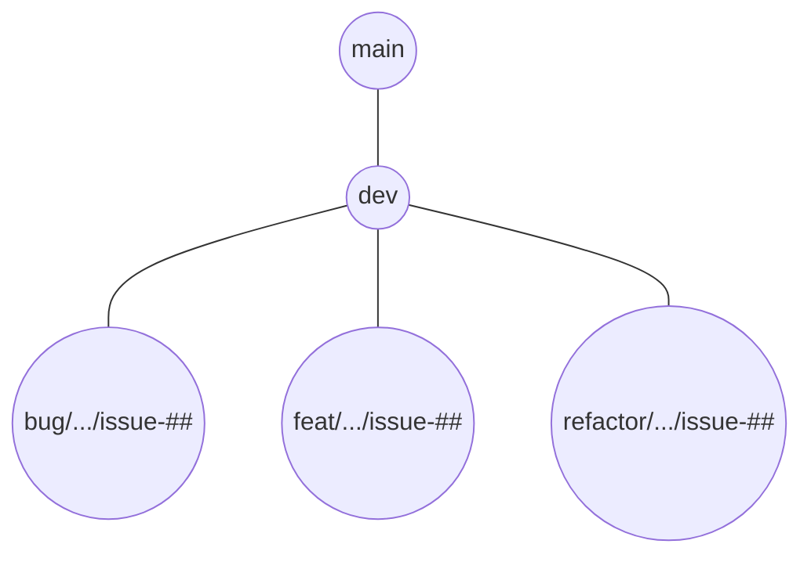

# Tournament Application
This is a tournament application, created as part of the IDATT1002 (Systemutvikling) study course at NTNU.
The application is programmed in Java and uses javafx for the graphical user interface. 

# For developers
Are you working on this project? Follow our programming guidelines to ensure quality code and clear communication!

## Setting up
### Requirements
- Java JDK version 17 (Tested with openjdk-17 version 17.0.2)
- Maven version 3.8+ (Tested with Maven version 3.8.4)

Once you have set up java, you should be able to type `java --version` and `javac --version` in a terminal/shell.
Ensure that you also have access to maven commands in a terminal/shell by typing `mvn --version`.

### Steps to get it running
1. Clone this repository
2. Make sure you are on the correct branch
3. Open a terminal and run `mvn dependency:resolve` in the projects root directory (this is also the folder in which you find the pom.xml file)
4. Ensure your editor has reloaded the newly resolved maven dependencies (In IntelliJ there will be a "Maven" tab on the top right, then click the reload icon furthest to the left)

Access to the google API is also needed for the application to function properly. This can be done in one of two ways:
1. **Access to our google application**  If you want to get access to our google aplication and the corresponding access tokens, please contact one of the maintainers of this project.
2. **Create your own google application**  If you want to create your own google application refer to the guides provided by Google. When your application has been created, make sure you have enabled the following APIs:
   - Google sheets API
   - Google drive API
Once this is in order, you can create OAuth 2.0 Client ID by going to the API and Services dashboard -> credentials -> create credentials -> OAuth Client ID. Once you have created your OAuth Client ID, it can be downloaded as a JSON file. Save this file in a userdata file inside of the resources folder as 'google-credentials.json'.

The application should now work as intended when run.

### How to compile the application
The application can be compiled to an uber jar-file packaged with all dependencies by running this the command `mvn clean package shade:shade`, or the command `mvn clean package shade:shade -DskipTests` if you want to compile without running the tests. These commands need to be run inside of the 'quizmaker' directory. A fully working compiled jar-file should now be present in the 'target' directory.

## Issue template
When creating an issue, it is important that the issue is *specific* and has a *measurable goal*. It is ok to leave out details *as long as* you specify that
you will update the issue once specific goals and "feasableness" has been more thoroughly discussed (in the comments of the issue for example).

What an issue should include:
- A desired change with a specific goal (e.g. add an easter egg button to display an easter bunny)
- A reason why the change is necessary
- (for bugs: ) Actual behavious vs expected behaviour
- (for bugs: ) Reproduction steps

What **not** to create as an issue:
- Abstract long-term goals. (e.g. Finish the project. )
- Discussions (e.g. What should we work on now guys?)
- Several problems (e.g. Rename project folder and add button to gui)

Once you have created your issue, take a second to ask yourself "What is does this issue address? When have I completed this issue? Is this issue specific?"
If your issue description answers these three questions, you are probably good to go. 

## Git branch structure
The main and dev branches are protected branches which can not be directly commited to. Instead, new branches should be made for each feature, issue or change you want to
make to the code. Once you are done, you can merge the branch to dev on gitlab. To ensure merge conflicts do not arise, and that your branch works with the rest of dev,
you should merge dev to your branch that you are working on (you can do this locally) before merging to dev (which you do on GitLab). 

Here is a visualisation of the branches:

