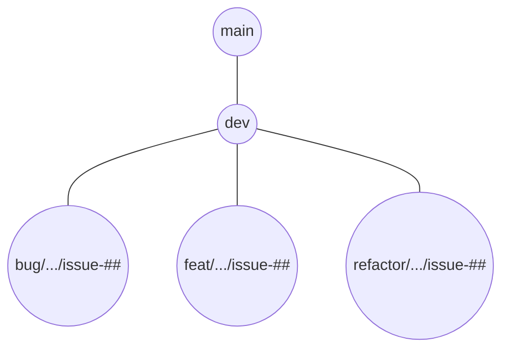

# GITLAB

```mermaid
graph TD
   a((main))
   b((dev))
   
   
   h((bug/.../issue-##))
   i((feat/.../issue-##))
   j((refactor/.../issue-##))
   
   a---b
   b---h
   b---i
   b---j
```

# Tournament Application

A tournament application, created as part of the IDATT1002 (Systemutvikling) study course at NTNU. 
